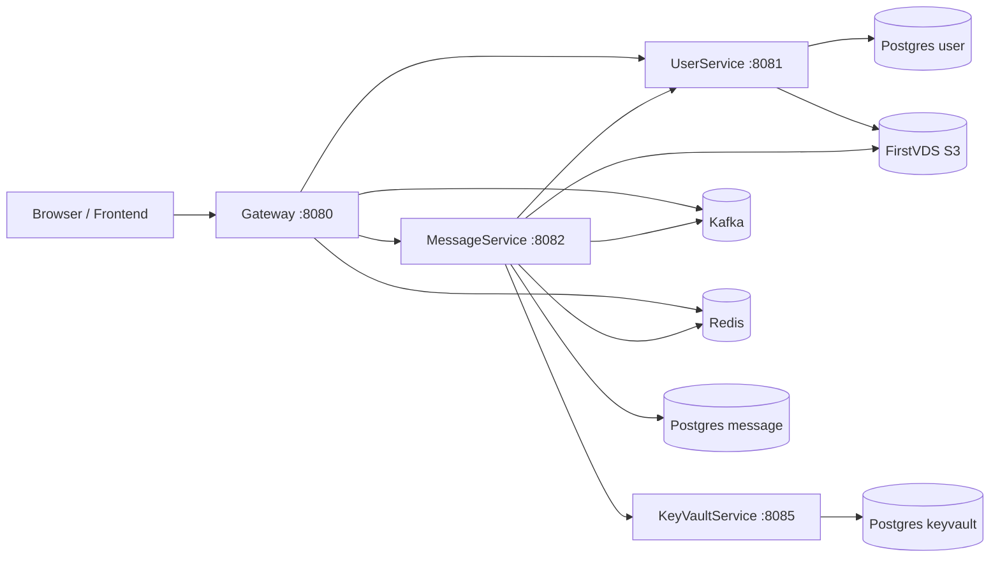

# Mescat Messenger

Mescat - учебный/экспериментальный мессенджер на микросервисной архитектуре Spring Boot. В проекте есть Kafka-события, WebSocket-доставка, клиентская логика шифрования, загрузка файлов через S3-совместимое хранилище и базовый frontend.

Проект все еще активно развивается. Его нельзя считать production-ready защищенным мессенджером без дополнительного аудита, тестов и доработок.

## Важное замечание про frontend

Frontend часть была сделана полностью при помощи нейронки, кроме архитектуры. За качество frontend части я не ручаюсь. В коде могут быть баги, спорные решения, лишняя сложность и места, которые нужно будет переписать или отрефакторить перед реальным использованием.

## Структура проекта

- `Gateway` - публичная точка входа, страницы авторизации/чата, frontend, WebSocket, прокси к backend-сервисам.
- `UserService` - пользователи, профиль, настройки, аватарки.
- `MessageService` - чаты, сообщения, участники, файлы чатов, ключи сообщений, Kafka-события.
- `KeyVaultService` - публичные ключи пользователей и записи для передачи новых приватных ключей между сессиями.
- `test` - smoke/e2e-скрипты и тестовые файлы.
- `docker-compose.yml` - локальный запуск инфраструктуры и сервисов.
- `.env.example` - пример переменных окружения.

## Общая архитектура



## Основные технологии

- Java 21
- Spring Boot 4
- PostgreSQL 16
- Redis 7
- Apache Kafka 4
- FirstVDS S3-compatible object storage
- Docker Compose

## Основные пользовательские сценарии

- Пользователь регистрируется или входит через `Gateway`.
- `Gateway` отдает страницы и статический frontend, включая `/chat.html`.
- Frontend в браузере создает и хранит пользовательские ключи локально.
- Запросы чатов/сообщений идут через `Gateway`; id пользователя берется из Spring Security username.
- `Gateway` пересылает запросы в `MessageService`, `UserService` или key endpoints.
- `MessageService` сохраняет чаты, сообщения и файлы в Postgres и публикует события в Kafka.
- `Gateway` слушает Kafka и отправляет события пользователям/чатам через WebSocket.
- Текст сообщений шифруется/дешифруется на клиенте. Сервер хранит зашифрованный payload и envelopes ключей, а не plaintext сообщений.
- Файлы чатов загружаются напрямую в S3 через временные POST policy, а потом подтверждаются через backend.
- Аватарки загружаются файлом, проверяются в `UserService`, копируются в публичный bucket и сохраняются в профиле как `avatarUrl`.

## Kafka topics

`docker-compose.yml` создает темы:

- `message-service` - события сообщений и файлов.
- `chat-service` - события чатов и участников.
- `encrypt-keys-service` - события доставки ключей.
- `delete-encrypt-keys` - события удаления ключей.
- `user-online` - событие подключения пользователя.

## S3 buckets

Рекомендуемая схема buckets:

- `mescat-avatars` - публичные аватарки. Браузер загружает их обычным ``.
- `mescat-files` - приватные файлы чатов и временные загрузки аватарок.

CORS должен разрешать origin, с которых браузер напрямую загружает файлы в S3. Пример:

```xml
<CORSConfiguration>
  <CORSRule>
    <AllowedOrigin>https://mescat.ru</AllowedOrigin>
    <AllowedOrigin>https://www.mescat.ru</AllowedOrigin>
    <AllowedOrigin>http://localhost:8080</AllowedOrigin>
    <AllowedMethod>GET</AllowedMethod>
    <AllowedMethod>POST</AllowedMethod>
    <AllowedMethod>HEAD</AllowedMethod>
    <AllowedHeader>*</AllowedHeader>
    <ExposeHeader>ETag</ExposeHeader>
  </CORSRule>
</CORSConfiguration>
```

Для аватарок нужен публичный read-доступ. Код выставляет `public-read` для новых финальных объектов аватарок, но настройки bucket/provider не должны это блокировать.

## Настройка окружения

Скопируй пример env-файла:

```powershell
Copy-Item .env.example .env
```

Обязательно заполни реальные значения:

- `S3_ACCESS_KEY`
- `S3_SECRET_KEY`

Остальные параметры имеют development defaults в `.env.example` и `docker-compose.yml`.

## Локальный запуск

```powershell
docker compose up -d --build
```

Открыть приложение:

```text
http://localhost:8080
http://localhost:8080/chat.html
```

Посмотреть контейнеры:

```powershell
docker compose ps
```

Остановить проект:

```powershell
docker compose down
```

Остановить и удалить volumes/базы:

```powershell
docker compose down -v
```

## Ручная сборка сервисов

```powershell
cd Gateway; .\mvnw.cmd -q -DskipTests compile
cd ..\UserService; .\mvnw.cmd -q -DskipTests compile
cd ..\MessageService; .\mvnw.cmd -q -DskipTests compile
cd ..\KeyVaultService; .\mvnw.cmd -q -DskipTests compile
```

## Smoke test

Основной e2e smoke-скрипт находится здесь:

```text
test/e2e-smoke.mjs
```

Запуск при поднятом compose stack:

```powershell
node .\test\e2e-smoke.mjs
```

Он проверяет регистрацию, настройки, ключи, личные/групповые чаты, сообщения, доставку ключей сообщений, загрузку файлов, preview URL для фото/видео, загрузку аватарки, публичность avatar URL и удаление сообщений.

## Текущий статус

Проект находится на этапе рабочего MVP мессенджера. Основная backend-архитектура уже собрана и связана между сервисами: есть регистрация, вход, профиль пользователя, настройки, личные и групповые чаты, сообщения, WebSocket-события, Kafka, Redis, PostgreSQL, пользовательские ключи, sender keys для сообщений, загрузка файлов и загрузка аватарок через S3.

Что уже реализовано:

- `Gateway` работает как единая публичная точка входа для браузера.
- Пользователь может зарегистрироваться, войти, выйти и открыть чат.
- User id берется из Spring Security, а не передается пользователем вручную.
- Есть базовый frontend чата с desktop/mobile разметкой.
- Есть поиск пользователей и создание личных диалогов.
- Есть создание групповых чатов и управление участниками.
- Есть отправка и получение сообщений.
- Сообщения хранятся на сервере в зашифрованном виде.
- Есть клиентская логика пользовательских ключей и sender keys.
- Есть доставка ключей сообщений другим участникам.
- Есть события через Kafka и доставка в браузер через WebSocket.
- Есть отображение новых событий без ручной перезагрузки страницы.
- Есть загрузка файлов в чат через S3 POST policy.
- Фото, видео и аудио могут отображаться inline в чате.
- Для файлов используется временная выдача download URL с проверкой доступа к чату.
- Есть загрузка аватарки файлом, проверка изображения и сохранение публичного `avatarUrl`.
- Аватарки отображаются как обычные картинки по ссылке.
- Есть базовый e2e smoke script, который проверяет ключевые сценарии проекта.

Что пока считается неидеальным или требует доработки:

- Frontend сделан при помощи нейронки и требует ручного ревью, чистки и рефакторинга.
- Криптографическая схема требует отдельного аудита и аккуратного документирования перед реальным использованием.
- Тестов мало: есть smoke/e2e script, но нет полноценного покрытия unit/integration tests.
- Нет полноценной системы мониторинга, health dashboard и production observability.
- Нет production-ready deployment-инструкции для сервера, домена, HTTPS и reverse proxy.
- Не все ошибки frontend могут быть красиво обработаны для пользователя.
- Нужно отдельно проверить поведение при плохой сети, истекших S3-ссылках и долгих загрузках больших файлов.
- Нужно дополнительно пройти сценарии нескольких устройств одного пользователя и восстановления ключей.
- Нужна финальная чистка логов, текстов ошибок и UX-деталей.

Итог: проект уже можно запускать локально через Docker Compose и использовать как рабочий прототип мессенджера. Backend-часть в целом собрана вокруг нужной архитектуры, но до production еще нужны тесты, аудит криптографии, стабилизация frontend, нормальный deployment и эксплуатационная доработка.
